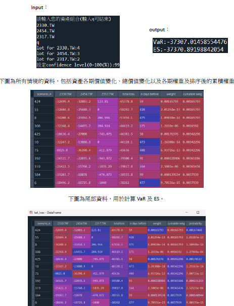

# 透過歷史情境模擬法計算VaR, ES
## 一、簡介
傳統的VaR 以及Expected shortfall, ES 算法，常會假設損失的分布，例如：
常態分佈，實證卻發現現實中的情況損失的分布常是肥尾且左偏，因此，常態
分佈的假設是不嚴謹的。而我在準備FRM 考試的過程中學習到了利用歷史情境
模擬法的計算方式，此方法是一種非參數方法，且無須假設損失分布就能預測
VaR 以及ES，不過此方法需要較複雜的計算，因此我利用python 實現了此方
法，用戶只需輸入其持有的資產再yahoo finance 的交易代碼，以及其持倉大
小，便能為您預測明天的VaR 以及ES。
## 二、歷史情境模擬法
Step1：
利用yfinance API，收集前n+1 期的各資產資料，並以dictionary 的型態
儲存。
Step2：
計算每期之間的因子變化(EX:利率、價格…)，如此一來變成功創建了n 個
不一樣的情境。
Step3：
套用此n 個情境至當期的投資組合價值，以預測明日的n 種不一樣的結
果。
Step4：
將此n 項結果的損失由大到小排序。
Step5：
計算此n 個結果的VaR 以及ES。
## 三、改良
歷史情境模擬法計算VaR, ES 能解決傳統計算方法的假設問題，但卻也產生
了另一個問題，等權重假設。為了改進歷史情境模擬法，可以對歷史數據設置
指數遞減的權重，也就是越久遠的數據權重越小；反之，則越大，如此一來就
可以解決等權重問題。
## 四、非等權重歷史情境模擬法
與原方法唯一不同之處為：計算n 種情境的權重，依照Wi=(1-λ)* (λ^(i-1))
計算各期情境權重。根據FRM 提供的資訊，λ=0.94 是常用的設定。
## 五、結果展示

